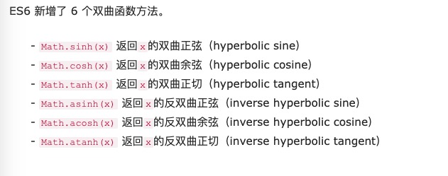

# 数值的扩展

数值的扩展主要是新增了很多方法和一个数据类型。

## 二进制和八进制表示法

八进制数值在`ES5`中使用`0`开头，这个是很不合理的，因为十进制也可以使用`0`开头。在`ES6`中，使用`0o`表示八进制，`0b`表示二进制（之前没有），`0x`表示十六进制（未变化）。

```js
0b111110111 === 503; // true
0o767 === 503; // true
```

现在也只有在非严格模式下的`ES5`代码中可以写`0`开头的八进制数代码了。

如果要将`0b`和`0o`开头的字符串转为 10 进制，只能使用`Number()`方法：

```js
Number('0b111'); // 7
Number('0o10'); // 8
```

## Number.isFinite()， Number.isNaN()

`Number.isFinite()`用来检查一个数字是不是有限的，如果数值不是正负`Infinity`返回`true`，否则返回`false`。参数值不是数字类型直接返回`false`。

```js
Number.isFinite(15); // true
Number.isFinite(0.8); // true
Number.isFinite(NaN); // false
Number.isFinite(Infinity); // false
Number.isFinite(-Infinity); // false
```

`Number.isNaN()`是用来检查一个值是不是`NaN`，`NaN`是一个特殊的`number`类型的值。它最重要的性质就是它是唯一一个和自己不全等的基础类型。由此可以推断出它的源码：

```js
if (!Number.isNaN) {
  Number.isNaN = function(n) {
    return typeof n === 'number' && window.isNaN(n);
  };
}
```

```js
Number.isNaN(NaN); // true
Number.isNaN(15); // false
Number.isNaN('15'); // false
Number.isNaN(true); // false
Number.isNaN(9 / NaN); // true
```

以上两种方法都是为了解决`ES5`中`isFinite()`和`isNaN()`的缺陷。缺陷在于传统方法会先将非数值的值转为数值，再进行判断。这就导致了传入非数值的参数也会会返回`true`。

```js
isNaN('A String'); // true
isNaN(undefined); // true
isNaN({}); // true

isFinite(null); // true
isFinite(0); // true
isFinite(2e64); // true
isFinite('0'); // true, 在更强壮的Number.isFinite('0')中将会得到false
```

## Number.parseInt()， Number.parseFloat()

`ES6`将全局方法`parseInt()`和`parseFloat`移植到了`Number`对象上，行为不变。

目的是为了逐步减少全局性方法，使语言逐步模块化。

```js
// ES5的写法
parseInt('12.34'); // 12
parseFloat('123.45#'); // 123.45

// ES6的写法
Number.parseInt('12.34'); // 12
Number.parseFloat('123.45#'); // 123.45

Number.parseInt === parseInt; // true
Number.parseFloat === parseFloat; // true
```

## Number.isInteger()

该方法用来判断一个数值是否为整数，如果参数不是数值，返回`false`。

```js
Number.isInteger(25); // true
Number.isInteger(25.1); // false
```

`JS`内部整数和浮点数采用的都是`IEEE754`双精度标准，数值存储为 64 位双精度格式。整数数值精度可以达到 53 个二进制位（52 + 1）。如果数值精度超出这个限度，多余的会被丢弃。这样该方法测试整数结果就不准确。同样，`JS`安全整数范围为`-2^53~2^53`，超出就会不安全。

判断是否为整数的其他方法还有取余（任何整数与 1 取余都是 0），使用`Math`的方法，如取整，四舍五入等，整数经过这些运算还是这个整数。通过`parseInt`运算，也是取整后相等。最后就是通过位运算符，`整数 | 0`还是之前的数字，不过只能处理 32 位以内的数字，虽然`JS`内部都是通过 64 位双精度浮点数存储，但是遇到位运算会转成 32 位存储再进行处理。

## Number.EPSILON

`Number.EPSILON`是一个常量，表示 1 与大于 1 的最小浮点数之间的差。

```js
Number.EPSILON === Math.pow(2, -52);
// true
Number.EPSILON;
// 2.220446049250313e-16
Number.EPSILON.toFixed(20);
// "0.00000000000000022204"
```

该常量是`JS`能够表示的最小精度，误差如果小于这个值，那就不叫误差了。该常量也是为浮点数计算设置一个误差范围，因为`JS`浮点数运算存在精度问题，是用该常量，可以内部设置精度。

## 安全整数和 Number.isSafeInteger()

`ES6`引入了`Number.MAX_SAFE_INTEGER`和`Number.MIN_SAFE_INTEGER`这两个常量来表示`JS`的最大和最小安全整数。

`Number.isSafeInteger()`用来判断一个整数是否在上述两个范围之内，参数不是`number`直接返回`false`。

```js
Number.isSafeInteger = function(n) {
  return (
    typeof n === 'number' &&
    Math.round(n) === n &&
    Number.MIN_SAFE_INTEGER <= n &&
    n <= Number.MAX_SAFE_INTEGER
  );
};
```

如果传入的是一个运算过程，需要将参与运算的每个值验证一下：

```js
Number.isSafeInteger(9007199254740993 - 990);
```

```js
function trusty(left, right, result) {
  if (
    Number.isSafeInteger(left) &&
    Number.isSafeInteger(right) &&
    Number.isSafeInteger(result)
  ) {
    return result;
  }
  throw new RangeError('Operation cannot be trusted!');
}
```

## Math 对象的扩展

`ES6`在`Math`对象上新增了 17 个与数学相关的方法。所有这些方法都是静态方法，只能在 `Math`对象上调用。

### Math.trunc()

去除一个数的小数部分，非数值会进行类型转换。

```js
Math.trunc(4.1); // 4
Math.trunc(4.9); // 4
Math.trunc(-4.1); // -4
Math.trunc(-4.9); // -4
Math.trunc(-0.1234); // -0
```

### Math.sign()

判断啊一个数是整数，负数还是零，非数值会进行类型转换。返回值为`+1, -1, 0, -0, NaN`。

```js
Math.sign(-5); // -1
Math.sign(5); // +1
Math.sign(0); // +0
Math.sign(-0); // -0
Math.sign(NaN); // NaN
```

### Math.cbrt()

计算一个数立方根，非数值会进行类型转换。

```js
Math.cbrt(-1); // -1
Math.cbrt(0); // 0
Math.cbrt(1); // 1
Math.cbrt(2); // 1.2599210498948734
```

### Math.clz32()

`Math.clz32()`方法将参数转为 32 位无符号整数的形式，然后返回这个 32 位值里面有多少个前导 0。会进行类型转换，只考虑整数部分，与左移运算符`<<`直接相关。

```js
Math.clz32(0); // 32
Math.clz32(1); // 31
Math.clz32(1000); // 22
Math.clz32(0b01000000000000000000000000000000); // 1
Math.clz32(0b00100000000000000000000000000000); // 2
```

### Math.imul()

`Math.imul`方法返回两个数以 32 位带符号整数形式相乘的结果，返回的也是一个 32 位的带符号整数。该方法可以返回正确的低位数值。

> 低位：在二级制中，与高位相对，表示二进制数字右边部分，如 0011，其中 11 为低位。

```js
Math.imul(2, 4); // 8 === (2 * 4) | 0
Math.imul(-1, 8); // -8
Math.imul(-2, -2); // 4
```

### Math.fround()

返回一个数的 32（1，23）位单精度浮点数形式。作用是将 64 位双精度浮点数转为 32 位单精度浮点数。如果小数的精度超过 24 个二进制位，返回值就会不同于原值，否则返回值不变（即与 64 位双精度值一致）。会进行类型转换，`NaN`和`Infinity`返回原值。

```JS
// 未丢失有效精度
Math.fround(1.125) // 1.125
Math.fround(7.25)  // 7.25

// 丢失精度
Math.fround(0.3)   // 0.30000001192092896
Math.fround(0.7)   // 0.699999988079071
Math.fround(1.0000000123) // 1

Math.fround(NaN)      // NaN
Math.fround(Infinity) // Infinity
```

### Math.hypot()

返回所有参数的平方和的平方根，会进行类型转换，有一个参数无法转换，返回`NaN`。

```JS
Math.hypot(3, 4);        // 5
Math.hypot(3, 4, 5);     // 7.0710678118654755
Math.hypot();            // 0
Math.hypot(NaN);         // NaN
Math.hypot(3, 4, 'foo'); // NaN
Math.hypot(3, 4, '5');   // 7.0710678118654755
Math.hypot(-3);          // 3
```

### 对数方法

- Math.expm1(x)：返回$e^x - 1$，即`Math.exp(x) - 1`。
- Math.log1p(x)：返回`1 + x`的自然对数，即`Math.log(1 + x)`，`x`小于 1，返回`NaN`。
- Math.log10(x)：返回以 10 为底`x`的对数，`x`小于 0，返回`NaN`。
- Math.log2(x)：返回以 2 为底`x`的对数，`x`小于 0，返回`NaN`。

### 双曲函数方法



## 指数运算符

`ES6`新增了指数运算符`**`。

```js
2 ** 2; // 4
2 ** 3; // 8
```

此运算符是右结合，多个指数运算符连用是从右往左算的。

```js
// 相当于 2 ** (3 ** 2)
2 ** (3 ** 2);
// 512
```

与等号`=`结合，产生新的赋值运算符。

```js
let a = 1.5;
a **= 2;
// 等同于 a = a * a;

let b = 4;
b **= 3;
// 等同于 b = b * b * b;
```

## BigInt 数据类型

`ES2020`引入了新的数据类型`BigInt`，来表示大整数。为了弥补`JS`最大安全整数范围限制的问题。只用来表示整数，没有位数的限制，任何位数的整数可以精确表示。`typeof`返回`bigint`。

```js
const a = 2172141653n;
const b = 15346349309n;

// BigInt 可以保持精度
a * b; // 33334444555566667777n

typeof 123n; // 'bigint'

// 普通整数无法保持精度
Number(a) * Number(b); // 33334444555566670000
```

为了和`Number`区分，必须加后缀`n`。使用其他进制表示也要加上后缀`n`。

```js
0b1101n; // 二进制
0o777n; // 八进制
0xffn; // 十六进制
```

同一个整数，使用普通整数和`BigInt`存储，并不相等。

```js
42n === 42; // false
```

可用负号不能用正号，会与`asm.js`冲突。

```js
-42n + 42n; // 正确 // 报错
```

### BigInt 对象

`JavaScript`原生提供`BigInt`对象，可以用作构造函数生成`BigInt`类型的数值。转换规则基本与`Number()`一致，将其他类型的值转为`BigInt`。

```js
BigInt(123); // 123n
BigInt('123'); // 123n
BigInt(false); // 0n
BigInt(true); // 1n
```

必须有参数，参数必须可以正常转为数值，小数也不行。

```js
new BigInt(); // TypeError
BigInt(undefined); //TypeError
BigInt(null); // TypeError
BigInt('123n'); // SyntaxError 也不行！！！
BigInt('abc'); // SyntaxError
BigInt(1.5); // RangeError
BigInt('1.5'); // SyntaxError
```

#### 静态方法

`BigInt.asIntN(width, BigInt)`：将`BigInt`值转换为一个-2<sup>width</sup> - 1 与 2<sup>width-1</sup>-1 之间的有符号整数。

```js
const max = 2n ** (64n - 1n) - 1n;

BigInt.asIntN(64, max);
// ↪ 9223372036854775807n

BigInt.asIntN(64, max + 1n);
// ↪ -9223372036854775808n
// negative because of overflow
```

`BigInt.asUintN`静态方法将`BigInt`转换为一个 0 到 2<sup>width</sup> - 1 之间的无符号整数。

```js
const max = 2n ** 64n - 1n;

BigInt.asUintN(64, max);
// ↪ 18446744073709551615n

BigInt.asUintN(64, max + 1n);
// ↪ 0n
// zero because of overflow
```

区别就是一个有符号，一个没符号。如果这两个方法指定了位数，如果位数小于数值本身，那么头部的位将被舍弃。

```js
const max = 2n ** (64n - 1n) - 1n;

BigInt.asIntN(32, max); // -1n
BigInt.asUintN(32, max); // 4294967295n
```

#### 转换规则

可以使用`Boolean()`，`Number()`和`String()`这三个方法，将`BigInt`转为布尔值，数值和字符串类型。

```js
Boolean(0n); // false
Boolean(1n); // true
Number(1n); // 1
String(1n); // "1" n 会消失
```

取反运算符也可以进行布尔值转换。

#### 数学运算

数学运算与`Number`除了除法行为一致，除法会舍去小数部分。返回一个整数。同时不能使用`>>>`和`+`运算符。因为前者不带符号，`BigInt`总是带符号的，没意义。后者和`asm.js`冲突。

`BigInt`不能和普通数值进行混合运算。`asm.js`里面，`|0`跟在一个数值的后面会返回一个 32 位整数。根据不能与`Number`类型混合运算的规则，`BigInt`如果与`|0`进行运算会报错。

#### 其他运算

布尔值转换与`Number`一致，只有`0n`会转为`false`。比较运算符可以和其他值混合运算。与字符串运算会先转为字符串，在进行运算。

```js
0n < 1; // true
0n < true; // true
0n == 0; // true
0n == false; // true
0n === 0; // false

'' + 123n; // "123"
```
