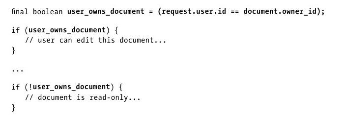
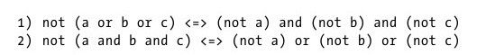
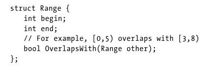
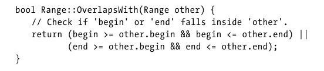
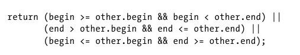
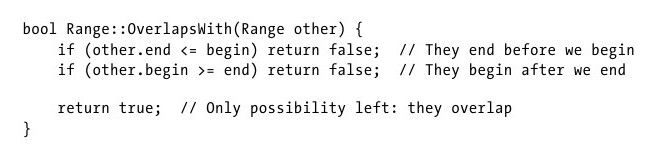
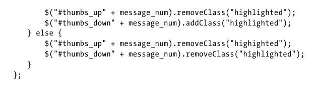
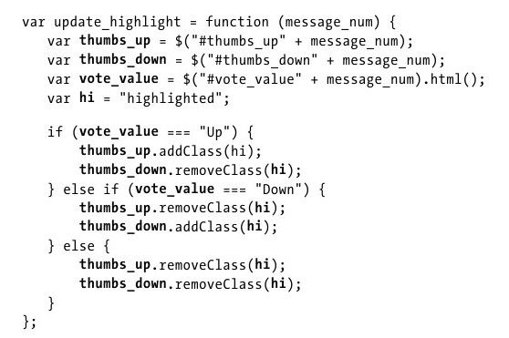
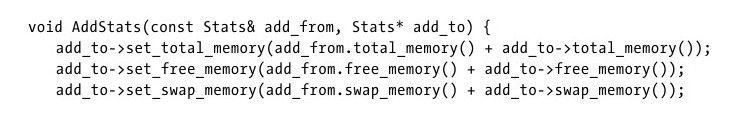
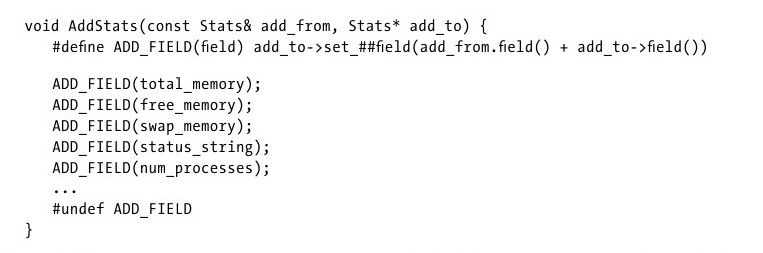

# 拆分超长的表达式

大多数人同时只能一次考虑 3~4 件事情（如果你不知道什么是大多数人的概念，我给一个通俗易懂的答案。如果你买彩票没中过奖，不出意外应该就是大多数人）。看代码也是如此，代码中的表达式太长，会严重影响读代码的效率。

本章探讨如何将超长的表达式拆分成更容易理解的小块。

## 用作解释的变量

拆分表达式最简单的方法就是引入一个额外的**解释变量**，该变量可以表示一个超长表达式中的一段子表达式。

```javascript
line.split(",")[0].join("") == "root";
```

很明显这是`JavaScript`中操作字符串来判断字符串中某一部分值是否和`root`相等。在该段代码中，需要考虑`line`、`line.split(',')`、`line.split(',')[0]`、`line.split(',')[0].join('')`。这是一段让人迷惑的代码，对需求一无所知的人不能理解这么处理的原因是什么，也不知道`root`是干什么的，但是如果添加一个解释变量：

```JavaScript
const userName = line.split(',')[0].join('')
userName == "root"
```

这样是不是看起来更简单一点呢？读代码的人甚至都不用知道`userName`的提取细节，就能明白代码的意思。

## 总结变量

即使一个表达式不需要解释（含义可以从字面看出），使用一个`总结变量`来承载这个表达式任然有用。目的就是让一个短很多的名字来代替一大块代码，会更容易管理和思考。


该段代码中包含五个变量，想要通过用户是否拥有自己的文档来判断一些操作，可以添加一个总结变量，让代码更加简洁和语义化。而且一开始就定义好的`user_owns_document`说明了这个变量是贯穿整个函数的概念。



## 使用德摩根定理

德摩根定理如下：



转换为代码就是：

```JavaScript
!(a || b || c) === !a && !b && !c
!(a && b && c) === !a || !b || !c
```

利用该定理进行转换可以让布尔表达式更有可读性。

## 滥用短路逻辑

短路逻辑就是在一些编程语言中，布尔操作会进行短路运算。例如`a || b`在`a`值为真的时候不会计算`b`, `a && b`在`a`值为假的时候不会计算`b`。

例如下面这段代码：

```C
assert((!(bucket = FindBucket(key))) || !bucket->IsOccupied());
```

这段代码的意思是先找`bucket`是不是存在的，存在的话确定`bucket`是不是被占了。这代码看着就莫名的烦躁，这么多括号要一层一层的去拆。

如果改成下边这样：

```C
bucket = FindBucket(key)
if(bucket != NULL) assert(!bucket -> IsOccupied())
```

看起来就很语义化，更加清晰。虽然前者代码看起来很“装逼”，但是这种代码对于后人来说就是灾难。

对于一些逻辑简单的功能，使用短路逻辑会很简洁和易读。但是如果功能比较复杂，一定要小心使用这种“智能”的代码段，它们往往会让人困惑。

短路行为的绝佳实践莫过于在`Python`，`JavaScript`,`Ruby`这样的代码中，会返回其中一个操作数而不是返回这些操作数运算后的布尔值。在`React`条件渲染中就可以使用该特点。也可以像`x = a || b || c`这样使用找出第一个为“真”的值。

## 例子：与复杂的逻辑战斗

假设要实现这个功能：



这是一个判断两个范围是否重叠的类。着重考虑的肯定是边界情况。下面来看第一种实现：



分析一下，代码错误很明显，因为范围都是左闭右开的。第一段的布尔运算中右侧和第二段布尔运算的左侧没有考虑到这种虽然数值相同，但是范围不重合的情况。

可以改为：



嘿嘿，我看到这种代码内心是不好受的，虽然能看，但是没必要这么写。

可以从问题的源头解决问题，判断重叠反过来就是判断不重叠。范围不重叠就两种情况：

1. 另一个范围在这个范围开始前结束。

2. 另一个范围在这个范围结束后开始。

可以将代码按照这个思路改为：



## 拆分巨大的语句

其实就是在巨大的语句中添加总结变量和解释变量，从而达到让代码简洁。

例如：



修改为：



这也是一个`DRY`（Dont't Repeat Yourself）的例子。

经过修改，成功解决了以下问题：

1. 它帮助避免录入错误。（实际上，你是否注意到在第一个例子中，该字符串在第 5 种情况中被误写成"highhighted"？）

2. 它进一步缩短了行的宽度，使代码更容易快速阅读。

3. 如果类的名字需要改变，只需要改一个地方即可。

## 简化表达式的其他方法

当有很多表达式，且每个表达式都做类似的事情，例如下面的代码：



这么长的代码其实就是在添加字段，只是每次字段不同。

这在`C++`中可以使用宏来定义，在其他语言可以通过封装一个函数来实现。



## 总结

本章给出了几种拆分表达式的方法，以便读者可以一段一段地消化。

- 一个简单的技术是引入“解释变量”来代表较长的子表达式。这种方式有三个好处：

  - 它把巨大的表达式拆成小段。

  - 它通过用简单的名字描述子表达式来让代码文档化。

  - 它帮助读者识别代码中的主要概念。

- 用德摩根定理来操作逻辑表达式——这个技术有时可以把布尔表达式用更整洁的方式重写（例如`if(!(a && !b))`变成`if(! a || b)`）。

- 本章给出了一个，把一个复杂的逻辑条件拆分成小的语句的例子，就像"`if(a＜b)……`"。实际上，在本章所有改进过的示例代码中，所有的`if`语句内都没有超过两个值。这是理想情况。可能不是总能做到这样——有时需要把问题“反向”或者考虑目标的对立面。

最后，尽管本章是关于拆分独立的表达式的，同样，这些技术也常应用于大的代码块。所以，你可以在任何见到复杂逻辑的地方大胆地去拆分它们。
